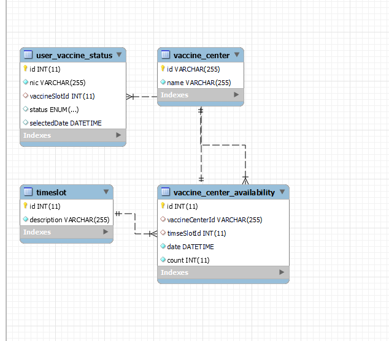
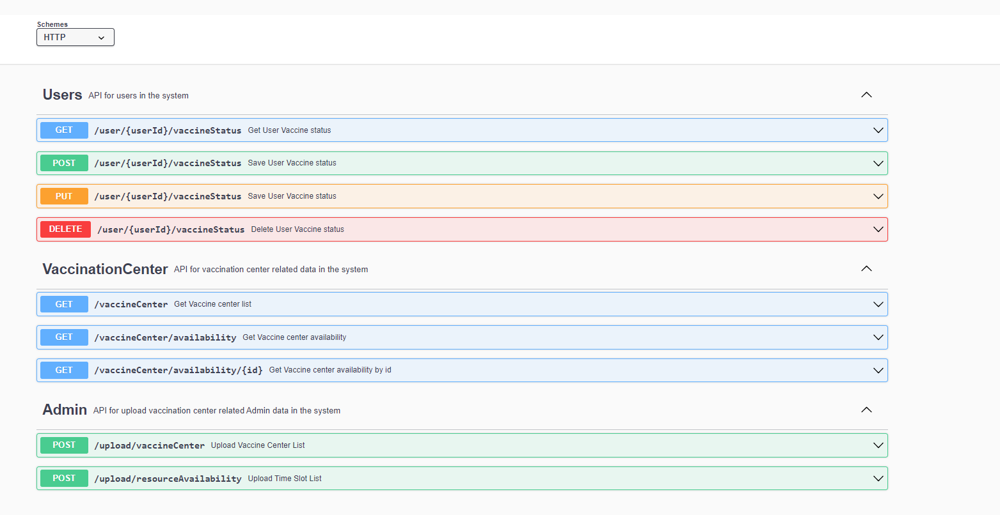

# Vaccine-Reservation-System
reservation system for COVID-19

## Database Design



<br>

## API

This repository contains the node js (Express based) API design for covid 19 Vaccine reservations.

<br>

## Available Endpoints



<br>

## Additional Libraries added
- sinon (for mocking repo calls when doing unit testing)
- lodash (some inbuilt utilities)
- joi + express-joi-validation (to validate request params)
- multer (multipart data upload - to upload vaccine center resources data)
- winston for logging
- sequelize as a DB ORM framework
<br>
<br>

## Package Structure
| S/N | Name | Type | Description |
|-----|------|------|-------------|
| 1 | external | dir | This holds the docker script if you need to up the DB in docker<br><b>This contains the initial data lod csv files to upload vaccine center data and vaccine center resources data</b>
| 2 | javascript | dir | This holds the source code |
| 3 | README.md | file | This file |
| 4 | VaccineCenterList.csv | file | Sample csv to upload Vaccine center List to the system |
| 5 | VaccineCenterNurseCount.csv | file | Sample csv to upload nurse count for vaccine centers in each week |
| 6 | Application/src/database/DDL.sql | file | DDL script if you need to set up the DB in local |
| 7 | Application/.env | file | To configure your env variables (like database configs, port configs) |

<br>

## Exposed Port
| S/N | Application | Exposed Port |
|-----|-------------|--------------|
| 1 | database | 3306 |
| 2 | frontend | 3000 |
| 3 | applicaiton | 8000 |
<br>

## Commands
All the commands listed should be ran in ./javascript directory.

### Installing dependencies
```bash
npm install
```

<br>

### Starting Project
Starting the project in local environment.
This will start all the dependencies services i.e. database and external (folder).
```bash
npm start
```

<br>

### Running in watch mode
This will start the application in watch mode.
```bash
npm run start:dev
```

<br>

### Check local application is started
You should be able to call (GET) the following endpoint and get a 200 response

```
http://localhost:8000/healthcheck
```

<br>

### Swagger URL
You should be able to call (GET) the following endpoint and get a 200 response

```
http://localhost:8000/api-docs/
```

<br>

## Design Assumptions

- Available resource (Ex:- Health Staff) for Each Vaccine center time slot will be uploaded to the system in every fortnight by a system Admin
- The system is designed to book 1 vaccine slot per user. Can be enhanced to book multiple vaccine Slots (Ex:- If a particular user has PENDING booking, He cannot make any new Vaccine slot, But He can delete or Update that Pending Vaccine Slot)
- If user's vaccine slot is passed, system Think it as Vaccination completed. (Vaccination Completion flow is not explicitly handled in this project)

## FrontEnd GitHub Link

https://github.com/AchiniP/Vaccine-Reservation-UI/tree/master
